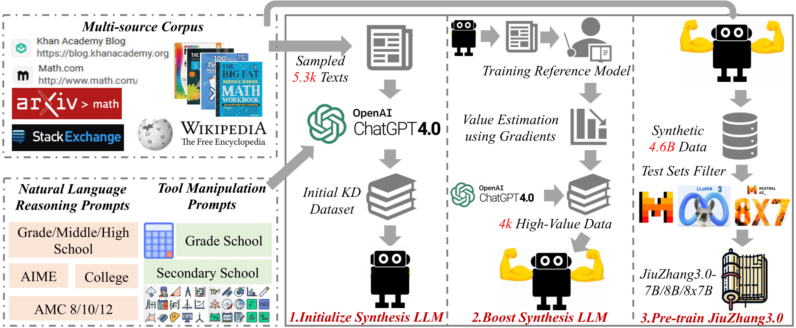

<h1 align="center">

<br>
JiuZhang3.0: Efficiently Improving Mathematical
Reasoning by Training Small Data Synthesis Models
</h1>
<p align="center">
  <a href="https://arxiv.org/abs/2405.14365"><b>[Paper]</b></a> •
  <a href="https://huggingface.co/collections/ToheartZhang/jiuzhang30-66508be8be5a61de47101655#/"><b>[Models]</b></a> •
  <a href="https://huggingface.co/collections/ToheartZhang/jiuzhang30-corpus-665092209525389ad7a2289a"><b>[Data]</b></a>
</p>

## Introduction
JiuZhang3.0 is a series of fine-tuned models for math reasoning continually pre-trained on corpus synthesized by our carefully trained small LLM.

### Method


### Experimental Results
For more evaluation results, please refer to the [Paper](https://arxiv.org/abs/2405.14365)

| Models                   | GSM8k | MATH | SVAMP | ASDiv | MAWPS | CARP | Avg.  |
|--------------------------|-------|------|-------|-------|-------|------|-------|
| GPT-4                    | 92.2  | 65.4 | 92.9  | 94.3  | 96.6  | 53.6 | 82.5  |
|**20B+ Models**||
| Llemma-34B               | 60.2  | 24.6 | 68.0  | 75.6  | 89.8  | 36.5 | 59.1  |
| Intern-Math-20B          | 64.9  | 27.4 | 74.9  | 79.6  | 94.4  | 42.3 | 63.9  |
| ChatGLM-Math-32B         | 82.6  | 40.6 | -     | -     | -     | -    | -     |
| MAmmoTH2-8x7B-Plus       | _86.4_| 47.0 | _90.0_| _92.2_| **97.0** | 45.8 | _76.4_ |
| [JiuZhang3.0-8x7B](https://huggingface.co/ToheartZhang/JiuZhang3.0-8x7B)   | **89.8** | **53.8** | **90.2** | **93.1** | _96.7_ | 52.3 | **79.3** |
|**7-8B Models**||
| Mistral-7B-MMIQC         | 75.0  | 34.2 | 73.5  | 82.1  | 90.1  | 36.5 | 65.2  |
| MetaMath-Mistral-7B      | 77.8  | 29.6 | 79.6  | 81.2  | 93.7  | 30.5 | 65.4  |
| Abel-7B-002              | 80.4  | 29.6 | 78.8  | 82.7  | 93.5  | 33.2 | 66.4  |
| WizardMath-7B-1.1        | 82.2  | 32.8 | 80.7  | 84.2  | 93.8  | 31.9 | 67.6  |
| Math-Shepherd-Mistral-7B | 84.3  | 34.4 | 82.9  | 82.8  | 92.5  | 32.9 | 68.3  |
| KPMath-DSMath-7B         | 83.9  | 48.8 | 81.5  | 88.9  | 94.8  | -    | -     |
| MAmmoTH2-7B-Plus         | 84.2  | 46.2 | _90.3_| 90.3  | _97.1_| 44.3 | 75.2  |
| MAmmoTH2-8B-Plus         | 84.4  | 41.2 | 89.9  | 89.9  | _97.1_| 44.8 | 74.6  |
| DeepSeekMath-7B-Instruct | 82.3  | 45.8 | 83.7  | 90.1  | 95.7  | 45.8 | 73.9  |
| DeepSeekMath-7B-RL       | 88.2  | 50.2 | 87.3  | 91.8  | 95.5  | **51.6** | 77.4  |
| [JiuZhang3.0-7B](https://huggingface.co/ToheartZhang/JiuZhang3.0-7B)     | **88.6** | **52.8** | **90.4** | **92.6** | **97.3** | _51.0_ | **78.8** |
| [JiuZhang3.0-8B](https://huggingface.co/ToheartZhang/JiuZhang3.0-8B)    | **88.6** | _51.0_ | 89.4  | **92.6** | _97.1_ | 50.9 | _78.3_ |

## Quick Start
### Setup
```
conda create -n jiuzhang python=3.10
conda activate jiuzhang
pip install -r requirements.txt
```

### Data Synthesis For Natural Language Reasoning
> The code is adapted from https://github.com/huggingface/cosmopedia

#### Prepare Data
To synthesize data, first collect prompts composing of math-related texts:
```bash
# Download MathPile
MATHPILE_PATH="/path/to/mathpile"
huggingface-cli download --resume-download --repo-type dataset GAIR/MathPile --local-dir $MATHPILE_PATH --local-dir-use-symlinks False
cd $MATHPILE_PATH/train
find . -type f -name "*.gz" -exec gzip -d {} \;
cd -

# Prepare data for synthesis
SAVE_DIR=/path/to/data
bash sh/synthesis/build_cot_data.sh $SAVE_DIR $MATHPILE_PATH
```

#### Synthesize Data
Then, use [JiuZhang3.0-Synthesis](https://huggingface.co/ToheartZhang/JiuZhang3.0-Synthesis-7B) to synthesize data. Prompts are listed in `prompts/cot`
```bash
SYNTHESIS_SAVE_PATH=/path/to/data
bash sh/synthesis/cot_synthesis.sh $SAVE_DIR/merged $SYNTHESIS_SAVE_PATH
```

<!-- ### Tool Manipulation Data Synthesis
```bash
bash sh/synthesis/code_synthesis.sh
``` -->

### Training
> The data packing strategy is adapted from https://github.com/MeetKai/functionary/tree/main/functionary/train/packing

To train a model, specify a path to save the prerocessed data, first load and process the corpus, then specify base model, checkpoint path, and DeepSpeed ZeRO stage to train.
```bash
DATA_PATH=/path/to/data
bash sh/train/prepare_train_data.sh $DATA_PATH

PT_PATH=meta-llama/Meta-Llama-3-8B
SAVE_PATH=/path/to/ckpt_llama
bash sh/train/train.sh $PT_PATH $DATA_PATH $SAVE_PATH "2"

PT_PATH=mistralai/Mistral-7B-v0.1
SAVE_PATH=/path/to/ckpt_mistral
bash sh/train/train.sh $PT_PATH $DATA_PATH $SAVE_PATH "2"

PT_PATH=mistralai/Mixtral-8x7B-v0.1
SAVE_PATH=/path/to/ckpt_mixtral
bash sh/train/train.sh $PT_PATH $DATA_PATH $SAVE_PATH "3"
```

### Evaluation
> The code is adapted from https://github.com/ZubinGou/math-evaluation-harness

To evaluate a model on benchmarks reported in the paper, specify the prompt type and the model path.
* For finetuned models for natural language reasoning
```bash
export CUDA_VISIBLE_DEVICES="0"
bash sh/eval/cot_model.sh jiuzhang "ToheartZhang/JiuZhang3.0-7B"
bash sh/eval/cot_model.sh jiuzhang "ToheartZhang/JiuZhang3.0-8B"
export CUDA_VISIBLE_DEVICES="0,1"
bash sh/eval/cot_model.sh jiuzhang "ToheartZhang/JiuZhang3.0-8x7B"
```
* For finetuned models for tool manipulation
> The data format is adapted from [ToRA](https://github.com/microsoft/ToRA)
```bash
export CUDA_VISIBLE_DEVICES="0"
bash sh/eval/tool_model.sh jiuzhang_tora "ToheartZhang/JiuZhang3.0-7B"
bash sh/eval/tool_model.sh jiuzhang_tora "ToheartZhang/JiuZhang3.0-8B"
export CUDA_VISIBLE_DEVICES="0,1"
bash sh/eval/tool_model.sh jiuzhang_tora "ToheartZhang/JiuZhang3.0-8x7B"
```
* For base model
```bash
export CUDA_VISIBLE_DEVICES="0"
bash sh/eval/base_model.sh cot deepseek-ai/deepseek-math-7b-base
```

## Citation
If you find this repository helpful, please consider citing our paper:

```
@article{zhou2024jiuzhang30,
      title={JiuZhang3.0: Efficiently Improving Mathematical Reasoning by Training Small Data Synthesis Models}, 
      author={Kun Zhou and Beichen Zhang and Jiapeng Wang and Zhipeng Chen and Wayne Xin Zhao and Jing Sha and Zhichao Sheng and Shijin Wang and Ji-Rong Wen},
      year={2024},
}
```